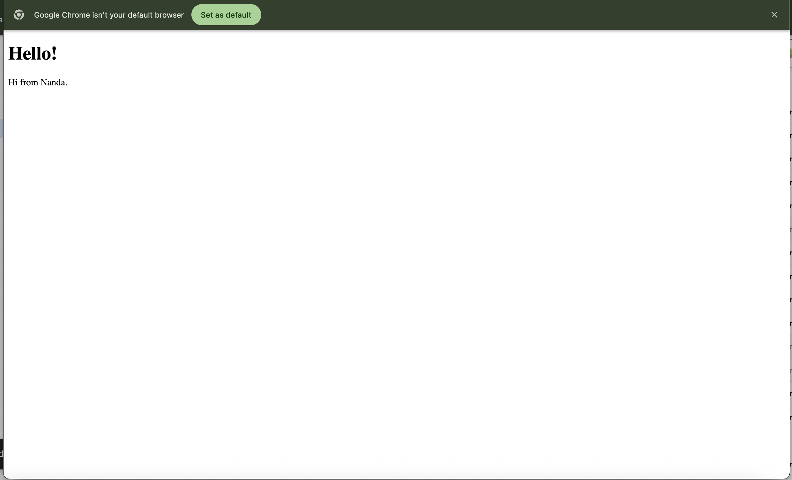

Tutorial 6 - Web Server

Commit 1 Reflection notes

Pada Milestone 1 ini, saya telah mempelajari cara membuat sebuah web server sederhana yang berjalan pada single thread menggunakan bahasa Rust. Saya menggunakan TcpListener dari standard library untuk membuka dan mendengarkan koneksi TCP yang masuk secara terus-menerus pada localhost port 7878. Selanjutnya, saya menambahkan fungsi handle_connection yang bertugas untuk memproses setiap stream koneksi TCP yang masuk. Di dalam fungsi itu, saya menggunakan BufReader untuk membaca data request dari browser secara efisien dari stream, baris demi baris. Kemudian, saya mengumpulkan baris-baris teks tersebut ke dalam sebuah struktur data Vector dengan memanfaatkan metode fungsional seperti lines(), map(), dan take_while() hingga menjumpai baris kosong. Terakhir, saya mencetak isi dari request tersebut ke terminal menggunakan makro println!. Hal ini memungkinkan saya untuk melihat langsung format HTTP request yang dikirimkan oleh browser, seperti metode GET, Host, dan User-Agent yang digunakan.

Commit 2 Reflection notes

Di Milestone 2 ini, saya telah memodifikasi fungsi handle_connection agar server tidak hanya menerima koneksi, tetapi juga dapat membalasnya dengan menampilkan halaman web HTML yang nyata. Untuk mewujudkannya, saya membuat sebuah file statis bernama hello.html yang memuat struktur halaman antarmuka web. Di dalam kode Rust, saya memanfaatkan modul fs (file system) dari standard library untuk membaca seluruh isi file HTML tersebut menjadi format string melalui metode fs::read_to_string(). Selanjutnya, saya menyusun HTTP response yang sesuai dengan protokol standar, diawali dengan status line HTTP/1.1 200 OK untuk menandakan bahwa permintaan berhasil diproses tanpa masalah. Saya juga menghitung panjang konten menggunakan metode len() dan menyisipkannya secara dinamis ke dalam header Content-Length. Semua bagian tersebut kemudian saya gabungkan menggunakan makro format!, dengan menggunakan penanda CRLF (\r\n\r\n) yang memisahkan antara bagian header HTTP dan body konten. Terakhir, response yang sudah tersusun utuh tersebut diubah menjadi byte dan dikirimkan kembali ke stream TCP menggunakan stream.write_all(), sehingga browser pengguna akhirnya dapat melakukan proses rendering halaman web buatan saya.

